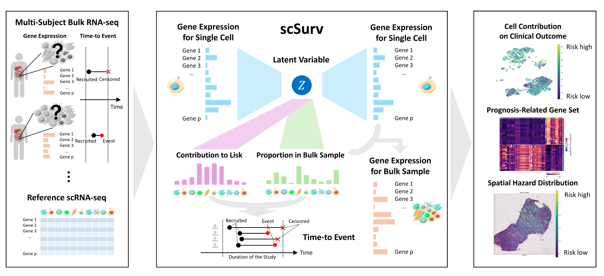
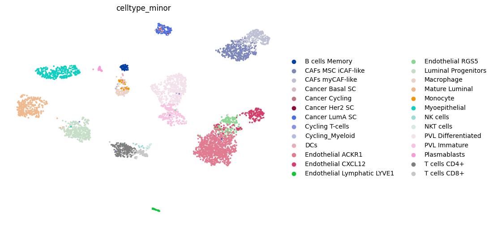
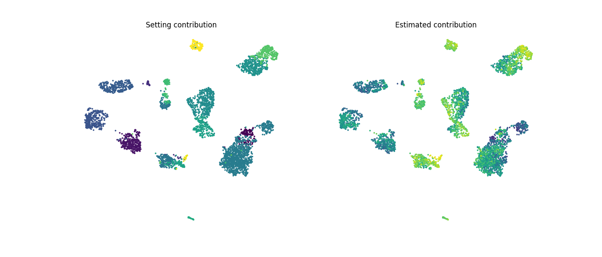
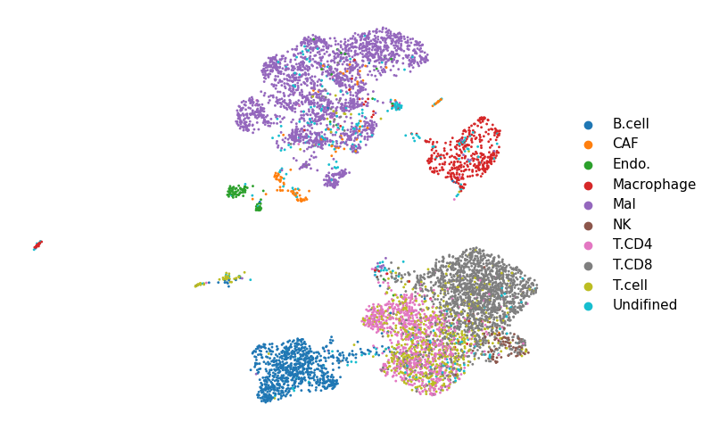
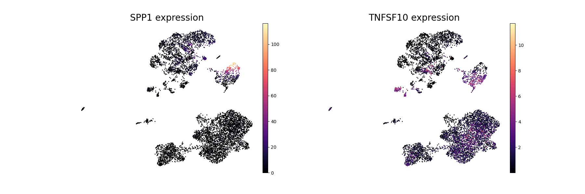

# scSurv
## Description
[scSurv](https://www.biorxiv.org/content/10.1101/2024.12.10.627659v1) is a novel method for single-cell survival analysis.
This model offers three main analyses:
1. Quantification of individual cells' contributions to clinical outcomes
2. Identification of prognosis-associated gene sets
3. Mapping of spatial hazard distributions using spatial transcriptome data

Through these applications, scSurv provides a comprehensive and interpretable framework that reveals heterogeneity in the clinical significance of cells. 
This framework enables the identification of novel cell populations and genes involved in the prognosis.

[Teppei Shimamura's lab](https://www.shimamlab.info/), Institute of Science Tokyo, Tokyo, Japan

[Yasuhiro Kojima's lab](https://www.ncc.go.jp/jp/ri/division/computational_life_science),   National Cancer Center Research Institute, Tokyo, Japan



## The scSurv framework
1. The VAE compresses raw gene expression into low-dimensional latent cell representations
2. Deconvolution of bulk data
3. Estimation of regression coefficients in hazard functions for each cell using the extended Cox proportional hazards model

# Installation
You can install scSurv using pip command.
```
!pip install scsurv
```
You can use the latest development version from GitHub.
```
!git clone https://github.com/3254c/scSurv.git
```

# Dependencies
Python >= 3.8.16

torch >= 1.13.1

lifelines >= 0.27.8

scanpy >= 1.9.5

pandas >= 1.5.3

numpy >= 1.23.5

matplotlib >= 3.7.2

scipy >= 1.10.1

# Minimal example
## Preparing scRNA-seq data and bulk RNA-seq data
You need to prepare reference scRNA-seq data and bulk RNA-seq data linked to clinical outcome. For instance, TCGA bulk RNA-seq data is available from the Genomic Data Commons (GDC) Data Portal (https://portal.gdc.cancer.gov/). For examples of reference scRNA-seq data, please refer to our paper. 

## Run scSurv (simulated data)
In [this tutolial](tutorial/tutolial_simulation.ipynb), we demonstrate the usage of scSurv using simulated data.
The bulk_adata.obs must contain the survival outcome data and the event indicators (censoring status).
The scRNA-seq and bulk RNA-seq data must be raw counts.
Please specify the batch_key parameter to indicate the sample origin annotation for each cell.
```
batch_key = 'orig.ident'
exp_name = 'tutolial_simulation.pt'
epoch = 10000
sc_adata, bulk_adata, model_params_dict, spatial_adata, scsurv_exp = workflow.run_scSurv(sc_adata, bulk_adata, exp_name, epoch, batch_key)
sc_adata, bulk_adata, _ = workflow.post_process(scsurv_exp, sc_adata, bulk_adata)
```



## Run scSurv (melanoma data)
[This tutolial](tutorial/tutolial_SKCM.ipynb) demonstrates running scSurv using a melanoma scRNA-seq dataset and a TCGA-SKCM bulkRNA-seq dataset. Since the scRNA-seq data is used as a reference, data that includes many patients is recommended. The scSurv paper used was GSE115978. The TCGA-SKCM bulkRNA-seq data should be provided by the user via the GDC Data Portal.
```
bulk_adata = None
batch_key = 'samples'
exp_name = None
epoch = 10000
sc_adata, bulk_adata, _, _, vaesm_exp = workflow.run_scSurv(sc_adata, bulk_adata, exp_name, epoch, batch_key, saved_path = saved_pt)
sc_adata, bulk_adata, _ = workflow.post_process(scsurv_exp, sc_adata, bulk_adata)
```




## Explanation of each function
``workflow.run_scSurv``: Runs the three steps of scSurv (VAE, deconvolution, and survival analysis)

``workflow.post_process``: Saves the results of scSurv to anndata

``workflow.scSurv_preprocess``: Preprocesses the prepared single-cell data and bulk data

``workflow.scSurv_preprocess_spatial``: If using spatial transcriptome data, preprocesses the prepared single-cell data, bulk data, and spatial transcriptome data
