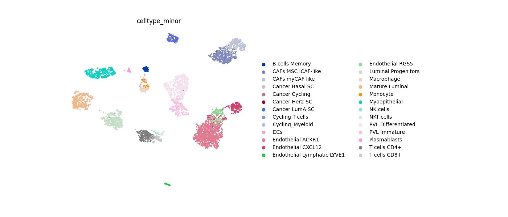
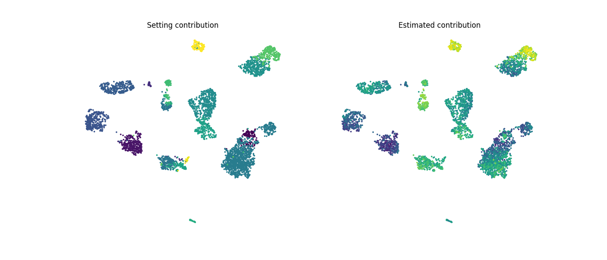

# scSurv (a deep generative model for single-cell survival analysis)
scSurv is a novel method for single-cell survival analysis.

[Teppei Shimamura's lab](https://www.shimamlab.info/), Tokyo Medical and Dental university at Tokyo and Nagoya University at Nagoya

[Yasuhiro Kojima's lab](https://www.ncc.go.jp/jp/ri/division/computational_life_science),   National Cancer Center Research Institute at Tokyo

Developed by Chikara Mizukoshi

# Instalation
You can use the latest development version from GitHub.
```
!git clone https://github.com/3254c/scSurv.git
```
# Usage
You need to prepare reference scRNA-seq data and bulk RNA-seq data linked to clinical outcome. For example, TCGA bulk RNA-seq data is available from the Genomic Data Commons (GDC) Data Portal (https://portal.gdc.cancer.gov/). For examples of reference scRNA-seq data, please refer to our paper. 

In the tutorial, we demonstrate the usage of scSurv using simulated data.
The bulk_adata.obs must contain the survival outcome data and the event indicators (censoring status).
The scRNA-seq and bulk RNA-seq data must be raw counts.
Please specify the batch_key parameter to indicate the sample origin annotation for each cell.
```
batch_key = 'orig.ident'
exp_name = 'tutolial_simulation.pt'
epoch = 10000

sc_adata, bulk_adata, model_params_dict, spatial_adata, vaesm_exp = workflow.run_scSurv(sc_adata, bulk_adata, exp_name, epoch, batch_key)
```

